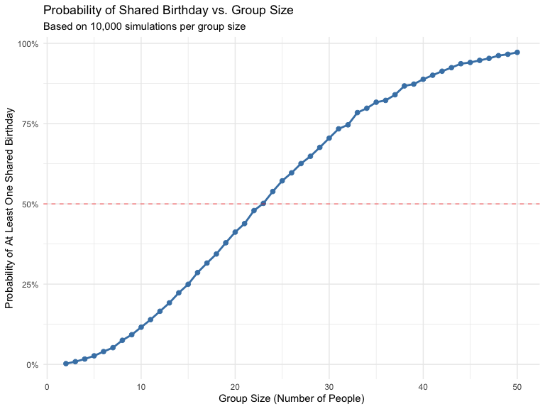
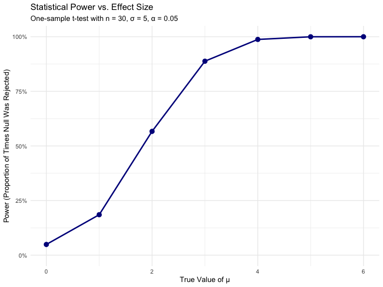
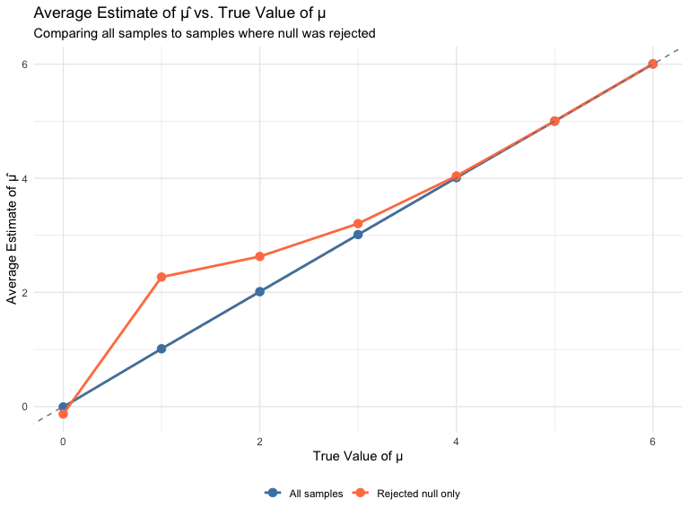
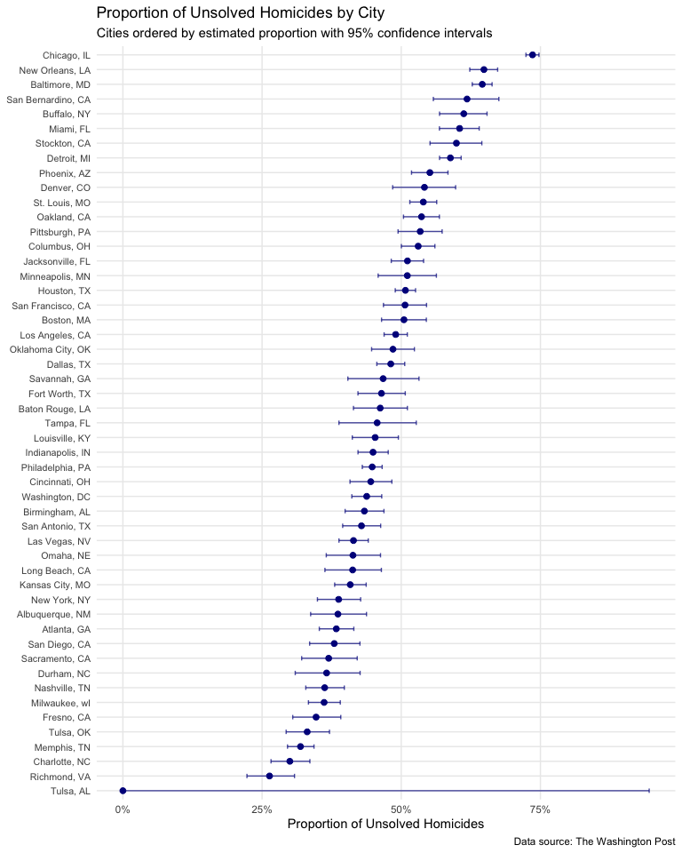

P8105 Homework 5
================
Bowen Xia bx2232
2025-11-14

``` r
library(tidyverse)
library(broom)

set.seed(1)
```

## Problem 1

In this problem, I explore the birthday paradox through simulation. The
question is: in a group of n people, what is the probability that at
least two people share a birthday?

### Simulation Function

``` r
birthday_sim = function(n) {
  birthdays = sample(1:365, size = n, replace = TRUE)
  any(duplicated(birthdays))
}
```

### Running the Simulation

I run this simulation 10,000 times for each group size from 2 to 50
people to estimate the probability of at least one shared birthday.

``` r
sim_results = 
  tibble(group_size = 2:50) |>
  mutate(
    probability = map_dbl(
      group_size, 
      ~mean(replicate(10000, birthday_sim(.x)))
    )
  )

head(sim_results)
```

    ## # A tibble: 6 × 2
    ##   group_size probability
    ##        <int>       <dbl>
    ## 1          2      0.0024
    ## 2          3      0.0085
    ## 3          4      0.0167
    ## 4          5      0.0267
    ## 5          6      0.0399
    ## 6          7      0.0521

### Visualization

``` r
sim_results |>
  ggplot(aes(x = group_size, y = probability)) +
  geom_line(color = "steelblue", linewidth = 1) +
  geom_point(color = "steelblue", size = 2) +
  geom_hline(yintercept = 0.5, linetype = "dashed", color = "red", alpha = 0.5) +
  scale_y_continuous(labels = scales::percent_format()) +
  labs(
    title = "Probability of Shared Birthday vs. Group Size",
    subtitle = "Based on 10,000 simulations per group size",
    x = "Group Size (Number of People)",
    y = "Probability of At Least One Shared Birthday"
  ) +
  theme_minimal()
```

<!-- -->

### Results and Interpretation

The simulation results demonstrate the counterintuitive nature of the
birthday paradox. The probability of at least one shared birthday
increases rapidly with group size, exceeding 50% at approximately 23
people (shown by the red dashed line). By the time we reach 50 people,
the probability approaches nearly 100%.

This surprising result occurs because we are not looking for someone to
match a specific birthday, but rather for any match among all possible
pairs of people. The number of possible pairs grows quadratically with
group size according to the formula n(n-1)/2. With 23 people, there are
253 possible pairs to compare, which explains why the probability
reaches 50% much sooner than intuition suggests.

The steep increase in probability between 10 and 40 people illustrates
how quickly the likelihood of shared birthdays accumulates as we add
more people to the group.

## Problem 2

This problem explores statistical power through simulation. Power is the
probability of correctly rejecting a false null hypothesis, and it
depends on sample size, effect size, and error variance.

### Design Elements

I use the following fixed parameters:

- Sample size: n = 30
- Standard deviation: σ = 5  
- Significance level: α = 0.05
- Number of simulations: 5000 per effect size

### Simulation Function

``` r
sim_t_test = function(mu, n = 30, sigma = 5) {
  sample_data = rnorm(n = n, mean = mu, sd = sigma)
  test_result = 
    t.test(sample_data, mu = 0) |>
    broom::tidy() |>
    select(estimate, p.value)
  
  return(test_result)
}
```

### Simulation for μ = 0

First, I generate 5000 datasets when the null hypothesis is true (μ =
0).

``` r
sim_results_mu0 = 
  tibble(iteration = 1:5000) |>
  mutate(
    results = map(iteration, ~sim_t_test(mu = 0))
  ) |>
  unnest(results)

mean(sim_results_mu0$p.value < 0.05)
```

    ## [1] 0.05

### Simulation for μ = {1, 2, 3, 4, 5, 6}

Now I repeat the simulation for different effect sizes to examine how
power changes.

``` r
sim_results_all = 
  tibble(true_mu = c(0, 1, 2, 3, 4, 5, 6)) |>
  mutate(
    sim_data = map(true_mu, ~{
      tibble(iteration = 1:5000) |>
        mutate(results = map(iteration, function(x) sim_t_test(mu = .x))) |>
        unnest(results)
    })
  ) |>
  unnest(sim_data)
```

### Power Analysis

``` r
power_results = 
  sim_results_all |>
  group_by(true_mu) |>
  summarize(
    power = mean(p.value < 0.05),
    avg_estimate = mean(estimate),
    avg_estimate_rejected = mean(estimate[p.value < 0.05])
  )

power_results |>
  knitr::kable(digits = 3)
```

| true_mu | power | avg_estimate | avg_estimate_rejected |
|--------:|------:|-------------:|----------------------:|
|       0 | 0.049 |       -0.008 |                -0.133 |
|       1 | 0.185 |        1.012 |                 2.269 |
|       2 | 0.567 |        2.013 |                 2.629 |
|       3 | 0.888 |        3.013 |                 3.206 |
|       4 | 0.988 |        4.011 |                 4.040 |
|       5 | 1.000 |        5.001 |                 5.002 |
|       6 | 1.000 |        6.004 |                 6.004 |

### Plot 1: Power vs. Effect Size

``` r
power_results |>
  ggplot(aes(x = true_mu, y = power)) +
  geom_line(color = "darkblue", linewidth = 1) +
  geom_point(color = "darkblue", size = 3) +
  scale_y_continuous(labels = scales::percent_format(), limits = c(0, 1)) +
  labs(
    title = "Statistical Power vs. Effect Size",
    subtitle = "One-sample t-test with n = 30, σ = 5, α = 0.05",
    x = "True Value of μ",
    y = "Power (Proportion of Times Null Was Rejected)"
  ) +
  theme_minimal()
```

<!-- -->

**Association between effect size and power:** There is a strong
positive relationship between effect size and power. As the true value
of μ increases from 0 to 6, power increases from approximately 0.05 (the
Type I error rate when the null is true) to nearly 1.0. The relationship
is non-linear, with the steepest increase occurring between μ = 1 and μ
= 4. This demonstrates that larger effects are easier to detect. With
our sample size of 30 and standard deviation of 5, we achieve adequate
power (≥ 0.80) when the true effect size reaches approximately μ = 2.5.

### Plot 2: Average Estimate of μ̂

``` r
power_results |>
  ggplot(aes(x = true_mu)) +
  geom_line(aes(y = avg_estimate, color = "All samples"), linewidth = 1) +
  geom_point(aes(y = avg_estimate, color = "All samples"), size = 3) +
  geom_line(aes(y = avg_estimate_rejected, color = "Rejected null only"), linewidth = 1) +
  geom_point(aes(y = avg_estimate_rejected, color = "Rejected null only"), size = 3) +
  geom_abline(intercept = 0, slope = 1, linetype = "dashed", color = "gray50") +
  scale_color_manual(
    values = c("All samples" = "steelblue", "Rejected null only" = "coral"),
    name = ""
  ) +
  labs(
    title = "Average Estimate of μ̂ vs. True Value of μ",
    subtitle = "Comparing all samples to samples where null was rejected",
    x = "True Value of μ",
    y = "Average Estimate of μ̂"
  ) +
  theme_minimal() +
  theme(legend.position = "bottom")
```

<!-- -->

**Is the sample average of μ̂ approximately equal to the true value of μ
when we only look at rejected tests?**

No, the sample average of μ̂ for tests where the null is rejected is
**not** approximately equal to the true μ, especially for smaller effect
sizes. This phenomenon demonstrates selection bias:

- **For small effect sizes (μ = 1, 2):** When power is low, we only
  reject the null hypothesis when we happen to observe unusually large
  sample means. This creates upward bias—the average estimate among
  rejected tests substantially exceeds the true value. For example, when
  μ = 1, the average rejected estimate is approximately 2.3,
  overestimating the true effect by more than double.

- **For large effect sizes (μ = 5, 6):** When power is very high
  (approaching 100%), almost all samples lead to rejection of the null
  hypothesis. Since nearly all samples are included, the average
  estimate among rejected tests closely matches the true value, showing
  minimal bias.

- **For all samples combined:** The blue line shows that when we don’t
  condition on statistical significance, the average estimate equals the
  true value across all effect sizes, confirming that μ̂ is an unbiased
  estimator of μ.

This finding has important implications for research. When studies are
underpowered and only statistically significant results are reported
(publication bias), the published effect size estimates will tend to be
inflated. This helps explain why effect sizes often appear smaller in
replication studies compared to the original underpowered studies that
“discovered” them. The bias disappears only when studies have adequate
power to detect the effect reliably.

## Problem 3

### Loading and Describing the Data

``` r
homicide_data = read_csv("data/homicide-data.csv")

glimpse(homicide_data)
```

    ## Rows: 52,179
    ## Columns: 12
    ## $ uid           <chr> "Alb-000001", "Alb-000002", "Alb-000003", "Alb-000004", …
    ## $ reported_date <dbl> 20100504, 20100216, 20100601, 20100101, 20100102, 201001…
    ## $ victim_last   <chr> "GARCIA", "MONTOYA", "SATTERFIELD", "MENDIOLA", "MULA", …
    ## $ victim_first  <chr> "JUAN", "CAMERON", "VIVIANA", "CARLOS", "VIVIAN", "GERAL…
    ## $ victim_race   <chr> "Hispanic", "Hispanic", "White", "Hispanic", "White", "W…
    ## $ victim_age    <chr> "78", "17", "15", "32", "72", "91", "52", "52", "56", "4…
    ## $ victim_sex    <chr> "Male", "Male", "Female", "Male", "Female", "Female", "M…
    ## $ city          <chr> "Albuquerque", "Albuquerque", "Albuquerque", "Albuquerqu…
    ## $ state         <chr> "NM", "NM", "NM", "NM", "NM", "NM", "NM", "NM", "NM", "N…
    ## $ lat           <dbl> 35.09579, 35.05681, 35.08609, 35.07849, 35.13036, 35.151…
    ## $ lon           <dbl> -106.5386, -106.7153, -106.6956, -106.5561, -106.5810, -…
    ## $ disposition   <chr> "Closed without arrest", "Closed by arrest", "Closed wit…

**Description of the raw data:**

The dataset contains 52179 homicide cases from 50 large U.S. cities. It
includes 12 variables that capture information about each homicide:

- **Victim demographics:** `victim_last`, `victim_first`, `victim_race`,
  `victim_age`, `victim_sex`
- **Case details:** `uid` (unique identifier), `reported_date` (date
  reported), `disposition` (case status)
- **Location:** `city`, `state`, `lat` (latitude), `lon` (longitude)

The `disposition` variable has three possible values indicating case
status: “Closed by arrest” (solved), “Closed without arrest” (unsolved),
and “Open/No arrest” (unsolved). The data spans multiple years and
covers major cities across the United States.

### Creating City-State Variable and Summarizing

``` r
homicide_summary = 
  homicide_data |>
  mutate(city_state = str_c(city, ", ", state)) |>
  group_by(city_state) |>
  summarize(
    total_homicides = n(),
    unsolved_homicides = sum(disposition %in% c("Closed without arrest", "Open/No arrest"))
  ) |>
  arrange(desc(total_homicides))

homicide_summary |>
  knitr::kable(
    col.names = c("City, State", "Total Homicides", "Unsolved Homicides")
  )
```

| City, State        | Total Homicides | Unsolved Homicides |
|:-------------------|----------------:|-------------------:|
| Chicago, IL        |            5535 |               4073 |
| Philadelphia, PA   |            3037 |               1360 |
| Houston, TX        |            2942 |               1493 |
| Baltimore, MD      |            2827 |               1825 |
| Detroit, MI        |            2519 |               1482 |
| Los Angeles, CA    |            2257 |               1106 |
| St. Louis, MO      |            1677 |                905 |
| Dallas, TX         |            1567 |                754 |
| Memphis, TN        |            1514 |                483 |
| New Orleans, LA    |            1434 |                930 |
| Las Vegas, NV      |            1381 |                572 |
| Washington, DC     |            1345 |                589 |
| Indianapolis, IN   |            1322 |                594 |
| Kansas City, MO    |            1190 |                486 |
| Jacksonville, FL   |            1168 |                597 |
| Milwaukee, wI      |            1115 |                403 |
| Columbus, OH       |            1084 |                575 |
| Atlanta, GA        |             973 |                373 |
| Oakland, CA        |             947 |                508 |
| Phoenix, AZ        |             914 |                504 |
| San Antonio, TX    |             833 |                357 |
| Birmingham, AL     |             800 |                347 |
| Nashville, TN      |             767 |                278 |
| Miami, FL          |             744 |                450 |
| Cincinnati, OH     |             694 |                309 |
| Charlotte, NC      |             687 |                206 |
| Oklahoma City, OK  |             672 |                326 |
| San Francisco, CA  |             663 |                336 |
| Pittsburgh, PA     |             631 |                337 |
| New York, NY       |             627 |                243 |
| Boston, MA         |             614 |                310 |
| Tulsa, OK          |             583 |                193 |
| Louisville, KY     |             576 |                261 |
| Fort Worth, TX     |             549 |                255 |
| Buffalo, NY        |             521 |                319 |
| Fresno, CA         |             487 |                169 |
| San Diego, CA      |             461 |                175 |
| Stockton, CA       |             444 |                266 |
| Richmond, VA       |             429 |                113 |
| Baton Rouge, LA    |             424 |                196 |
| Omaha, NE          |             409 |                169 |
| Albuquerque, NM    |             378 |                146 |
| Long Beach, CA     |             378 |                156 |
| Sacramento, CA     |             376 |                139 |
| Minneapolis, MN    |             366 |                187 |
| Denver, CO         |             312 |                169 |
| Durham, NC         |             276 |                101 |
| San Bernardino, CA |             275 |                170 |
| Savannah, GA       |             246 |                115 |
| Tampa, FL          |             208 |                 95 |
| Tulsa, AL          |               1 |                  0 |

The table shows substantial variation in homicide counts across cities.
Some cities have thousands of cases while others have fewer than 100.
The proportion of unsolved cases also varies considerably.

### Proportion Test for Baltimore, MD

``` r
baltimore_data = 
  homicide_summary |>
  filter(city_state == "Baltimore, MD")

baltimore_test = 
  prop.test(
    x = baltimore_data |> pull(unsolved_homicides),
    n = baltimore_data |> pull(total_homicides)
  )

baltimore_results = 
  baltimore_test |>
  broom::tidy() |>
  select(estimate, conf.low, conf.high)

baltimore_results |>
  knitr::kable(
    col.names = c("Estimated Proportion", "95% CI Lower", "95% CI Upper"),
    digits = 3
  )
```

| Estimated Proportion | 95% CI Lower | 95% CI Upper |
|---------------------:|-------------:|-------------:|
|                0.646 |        0.628 |        0.663 |

For Baltimore, MD, approximately 64.6% of homicides are unsolved, with a
95% confidence interval of (0.628, 0.663).

### Proportion Tests for All Cities

``` r
all_cities_results = 
  homicide_summary |>
  mutate(
    prop_test = map2(
      unsolved_homicides, 
      total_homicides,
      ~prop.test(x = .x, n = .y) |> broom::tidy()
    )
  ) |>
  unnest(prop_test) |>
  select(city_state, estimate, conf.low, conf.high)

all_cities_results |>
  head(10) |>
  knitr::kable(
    col.names = c("City, State", "Estimated Proportion", "95% CI Lower", "95% CI Upper"),
    digits = 3
  )
```

| City, State      | Estimated Proportion | 95% CI Lower | 95% CI Upper |
|:-----------------|---------------------:|-------------:|-------------:|
| Chicago, IL      |                0.736 |        0.724 |        0.747 |
| Philadelphia, PA |                0.448 |        0.430 |        0.466 |
| Houston, TX      |                0.507 |        0.489 |        0.526 |
| Baltimore, MD    |                0.646 |        0.628 |        0.663 |
| Detroit, MI      |                0.588 |        0.569 |        0.608 |
| Los Angeles, CA  |                0.490 |        0.469 |        0.511 |
| St. Louis, MO    |                0.540 |        0.515 |        0.564 |
| Dallas, TX       |                0.481 |        0.456 |        0.506 |
| Memphis, TN      |                0.319 |        0.296 |        0.343 |
| New Orleans, LA  |                0.649 |        0.623 |        0.673 |

### Visualization of Estimates and Confidence Intervals

``` r
all_cities_results |>
  mutate(city_state = fct_reorder(city_state, estimate)) |>
  ggplot(aes(x = estimate, y = city_state)) +
  geom_point(color = "darkblue", size = 2) +
  geom_errorbarh(
    aes(xmin = conf.low, xmax = conf.high),
    height = 0.3,
    color = "darkblue",
    alpha = 0.7
  ) +
  labs(
    title = "Proportion of Unsolved Homicides by City",
    subtitle = "Cities ordered by estimated proportion with 95% confidence intervals",
    x = "Proportion of Unsolved Homicides",
    y = NULL,
    caption = "Data source: The Washington Post"
  ) +
  scale_x_continuous(labels = scales::percent_format()) +
  theme_minimal() +
  theme(
    axis.text.y = element_text(size = 8),
    panel.grid.minor = element_blank()
  )
```

<!-- -->

### Key Findings

The visualization reveals substantial variation in unsolved homicide
rates across U.S. cities:

**Cities with highest unsolved rates:** Chicago, IL and New Orleans, LA
lead with over 70% of homicides remaining unsolved. Several other major
cities including Baltimore, MD, Detroit, MI, and San Bernardino, CA also
show unsolved rates exceeding 60%.

**Cities with lowest unsolved rates:** Richmond, VA has the lowest
proportion of unsolved homicides at approximately 26%, followed by
Charlotte, NC and Tulsa, OK, both under 35%.

**Confidence intervals:** The width of confidence intervals varies by
city, generally reflecting sample size. Cities with more total homicides
(like Chicago and Philadelphia) have narrower confidence intervals,
indicating more precise estimates. Smaller cities show wider intervals
due to greater uncertainty.

**Geographic patterns:** There appears to be regional variation, with
some clustering of high unsolved rates in major metropolitan areas. This
variation likely reflects differences in police resources, investigative
capacity, community relations, case complexity, and local policies.

The data highlights ongoing challenges many U.S. cities face in solving
homicides, with clearance rates varying dramatically across
jurisdictions. Cities with the highest unsolved rates may benefit from
additional investigative resources and improved community-police
partnerships.
